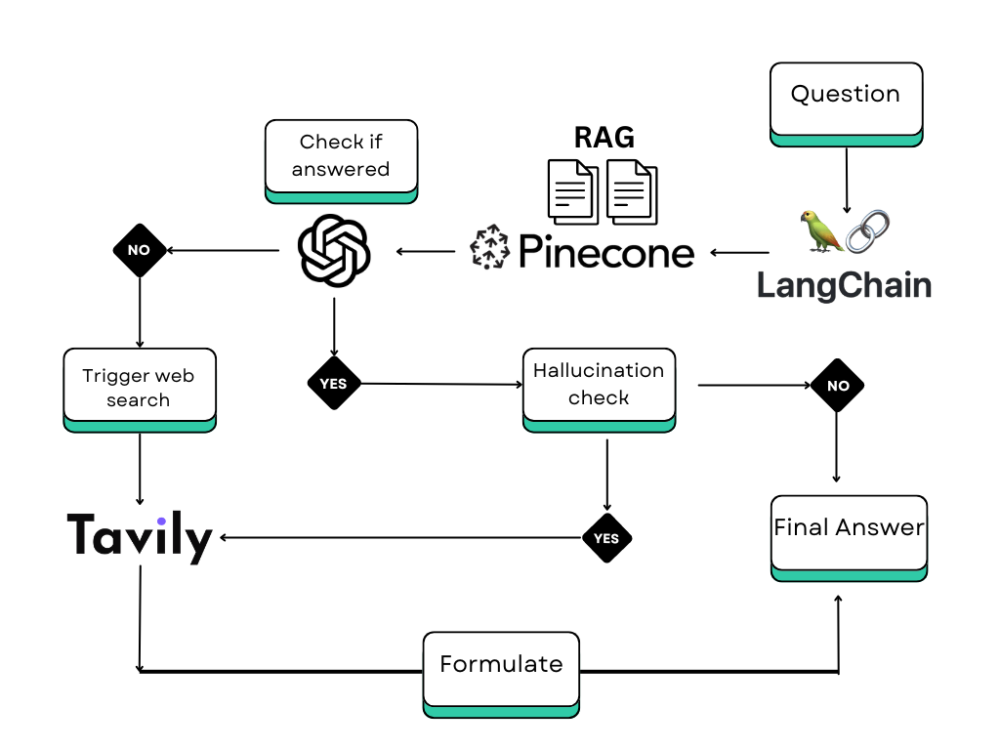

# Retrieval-Augmented Generation (RAG) for Contextualized Responses 🤖

## Overview

This repository hosts the implementation of a state-of-the-art Retrieval-Augmented Generation (RAG) system designed to integrate sophisticated document retrieval with advanced natural language understanding technologies. Our system leverages the latest advancements in vector search and machine learning to provide highly relevant and contextually accurate responses based on a given query.



Our RAG system combines the robust document retrieval capabilities of Pinecone with the cutting-edge language models from OpenAI, enhanced by contextual checks using Tavily API. This README offers a comprehensive guide on how to set up, utilize, and understand the power of our RAG system.

## Features

- **Document Retrieval**: Uses Pinecone to manage and retrieve documents based on vector similarity.
- **Contextual Relevance**: Enhances retrieval by checking context relevance through OpenAI's powerful GPT models.
- **Enhanced Accuracy**: Further refines responses by fetching detailed context from Tavily when initial responses lack sufficient relevance.
- **Scalability**: Efficiently scales to handle large datasets and complex query environments.

## Installation

To get started with our RAG system, follow these installation steps:

```bash
git clone https://github.com/zamalali/Agentive-RAG.git
cd RAG-Project
python3 -m venv rag_env
source rag_env/bin/activate
pip install -r requirements.txt
